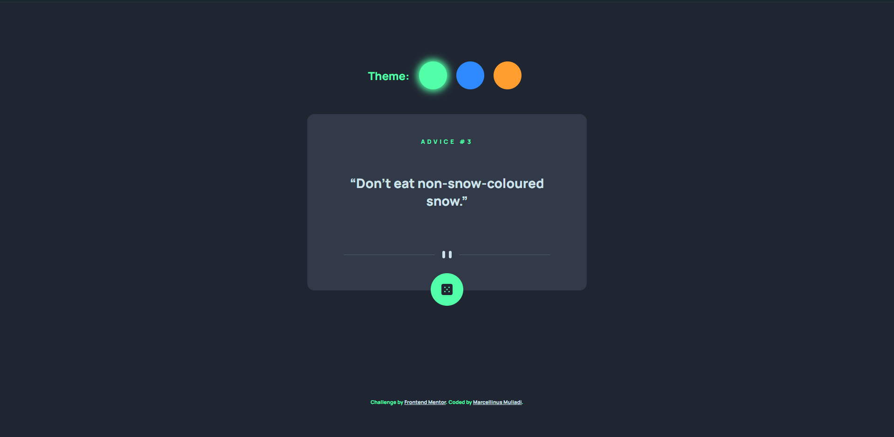
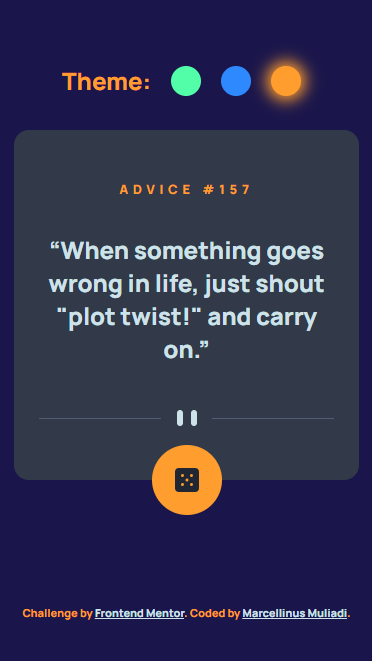

# Frontend Mentor - Advice generator app solution

This is a solution to the [Advice generator app challenge on Frontend Mentor](https://www.frontendmentor.io/challenges/advice-generator-app-QdUG-13db). Frontend Mentor challenges help you improve your coding skills by building realistic projects.

## Table of contents

- [Overview](#overview)
  - [The challenge](#the-challenge)
  - [Screenshot](#screenshot)
  - [Links](#links)

## Overview
This app provides users with a piece of advice generated from the [Advice Slip API](https://api.adviceslip.com/).

### The challenge

Users should be able to:

- View the optimal layout for the app depending on their device's screen size
- See hover states for all interactive elements on the page
- Generate a new piece of advice by clicking the dice icon

### Screenshots

Desktop Version:

Mobile Version:

### Links

- Solution URL: [Add solution URL here](https://github.com/MarMiMu/advice-api-app)
- Live Site URL: [Add live site URL here](https://marmimu.github.io/advice-api-app/)
